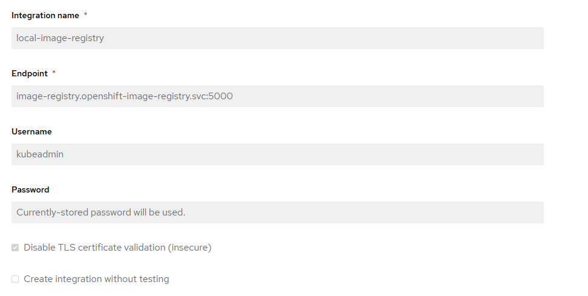

# roxctl-ocp-pipeline
Openshift Pipelines Integrated with RHACS

## DO NOT FORGET

- You need to create an integration in ACS to authenticate to the Openshift Local Image Registry. Here is a sample configuration

- The password will be the token of your user here. Which can be obtained with the following command `oc whoami -t`